# Here2Serve

This is the individual project for the Internet of Things course of "Sapienza" university of Rome, held during the accademic year 2021-2022. 
In a lot of situations, especially in the hot days, there is the need for a glass of cold water. It might require a bit of time and effort to pour water on it. So, a system that assists on pouring water when it is requested be very useful. There are a lot of systems that pour water when pressing a button. However, since this system can be used in public places and having a lot of people that press this buttonm may increase the risk. So it would be perfect to have a system that puor water and have the possibility to do that without even needing to press some buttons. That is why the system I am presenting here is created in such a way that is satisfies all the these requirements. 
It uses an ultrasonic sensor to measure the distance from the closest object/person and puors water when the distance is below a certain level.

## Architecture
In this section there are going to be shown the physical elements of the system, the sensors and the actuators. 

### Sensors
- **Ultrasonic sensor SRF05**
The sensor we are using here, as we said before, is an ultrasonic sensor. It measures the smallest distance of the objects from the sensor. The approach that this sensor uses to measure the smallest distance is by sending a trigger signal ans receiving an echo signal. The range is increased from 3 meters to SRF04 to 4 meters in this type.
You only need to supply a short 10uS pulse to the trigger input to start the ranging. The SRF05 will send out an 8 cycle burst of ultrasound at 40khz and raise its echo line high. It then listens for an echo, and as soon as it detects one it lowers the echo line again. The echo line is therefore a pulse whose width is proportional to the distance to the object. By timing the pulse it is possible to calculate the range in inches/centimeters or anything else. If nothing is detected then the SRF05 will lower its echo line anyway after about 30mS.
The system considers this distance and when needed, changes the state of the system. More specifically, if this distance is larger than 15 cm, the system doesn't react since it is considered that there is no intention o using the system if the system is located that far. Instead if the distance is between 5-15 cm, there may be intention to use the system, but still we have add the possibility to notify the user that if it comes any further, the state of the system may change. Finally, if the smallest object/person is located not further than 5 cm, the system changes its state and activate an relay.

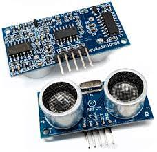 

### Actuators
- **Mini semaphore**
It has three LEDs: red, yellow, and green. They are used to provide feedback on the distance measured by the ultrasonic sensor. Initialially the semaphore has the green light on. This remain like this if after a measurement, the distance measured is not less than 15 cm. If this happen and the disntace is between 5-15 cm, the semaphore turn off the green light and turn on the yellow, notifying this was the change of the system state. Instead, if the distance is not more than 5 cm, the red light is the only one which is turned on.
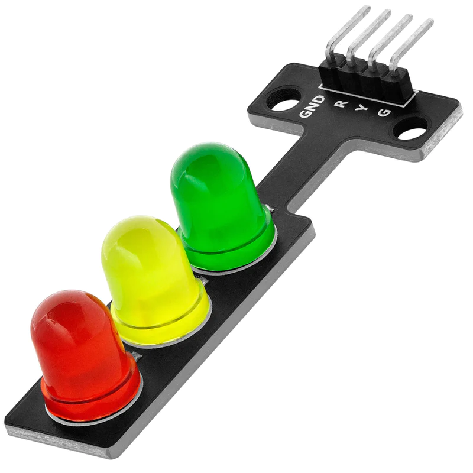 

- **1 channel relay**
This relay has the only purpose the activate the water pump. It is connected to the 3,3v, ground and an activation pin. This pin is activated when the distance measured is not more than 5 cm. When this happen, to the pin where the water pump is connected now has a potential of 5v. 

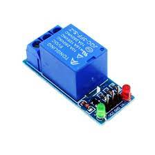 

- **Water pump**
As we said before, the water pump is activated only in the Red Zone state of the system. It is used to puor water into a glass or other possible containers. After every execution of the pump, there is also taen under consideration the amount of time is has been on, sending than this information into a dashboard. There might be than different calculations considering that the pump pours around 25 ml of liquid in a seconds. For an normal glass of 250 ml, the need time for switching the pump on is like 10 seconds. 
 

During the development part, we have noticed that the sensor measures an undeterministic and wrong value if the pump is on in that period. The solution proposed is to stop the activation of the pump for like 100 ml every 1 seconds(period of sampling the ultrasonic sensor).

### Overview
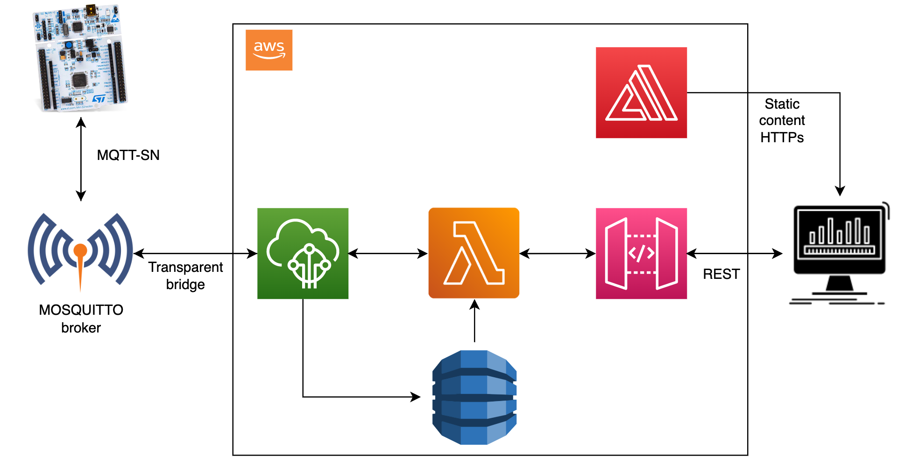 

In this images is shown an overview of all the system both in the local device and cloud lever. All the sensors and actuators are connected to a SMT NUCLEO-f401re board. We have used the RIOT-OS for its development. Instead, we have used the Amazon Web Services for the whole cloud configuration. 

The communication between the iot-device level and the cloud is done through communication protocol based on a publish/subscribe mechanism. Everytime we activate the water pump there is a message "Activation _time" send trough the "topic_2" to the Mosquitto broker using the MQTT-SN protocol. Then, Mosquitto broker sends the data to the AWS through a transparent bridge, written in python language. On the other hand, the board is subscribed to the topic "topic_1", where it receives 2 types of messages "Start" and "Stop". 

All the messages that arrive into the AWS broker, are stored to a DynamoDB database. This data is then shown to the dashboard using the call of a REST API that triger a lambda function to read this data from the database. There is instead another lambda function triggered when in the dashboard we hit the button 'Start' and 'Stop', sending exactly that message to the device level. They are used to let the users controlls the state of the system directly from the dashboard. 

## What the system does
In the level of the device, there is an ultrasonic sensor that every second, measures the distance from the smallest object/person, then it uses this distance to change the state of the system. More specifically, is the distance measured is greater than 15 cm, the state is on the state called "Green Zone", where the traffic light is set to green and the water pump is set off. This is considered the calm state where there is no intention to use the system functionality. If the distance measured is between 5-15 cm, the system state is called "Yellow Zone", where there the semaphore is set on the yellow state and still the water pump is off. This is considered as a warning state for the user to show that if they come any closer, there is goig to be an activation of the system. The system is located in the last state if the distance measured is not greater than 5 cm. Here the semaphore is set at red color and there is the activation of the pump, for all the time the system is in this state. After the system goes from the red to one of the other 2 states, it sends a message, which is a number showing the activation of the system. 
On the web dashboard, there is a chart showing all the values received from the AWS broker. There one coloumn for each activation, where the value shows the activation time expressed in seconds and the label shows the hour and minutes when the pump is activated. 
There are some other informations such as the last time the system was active and some data agregated such as the number of times it was active and the overall seconds it has been activated.
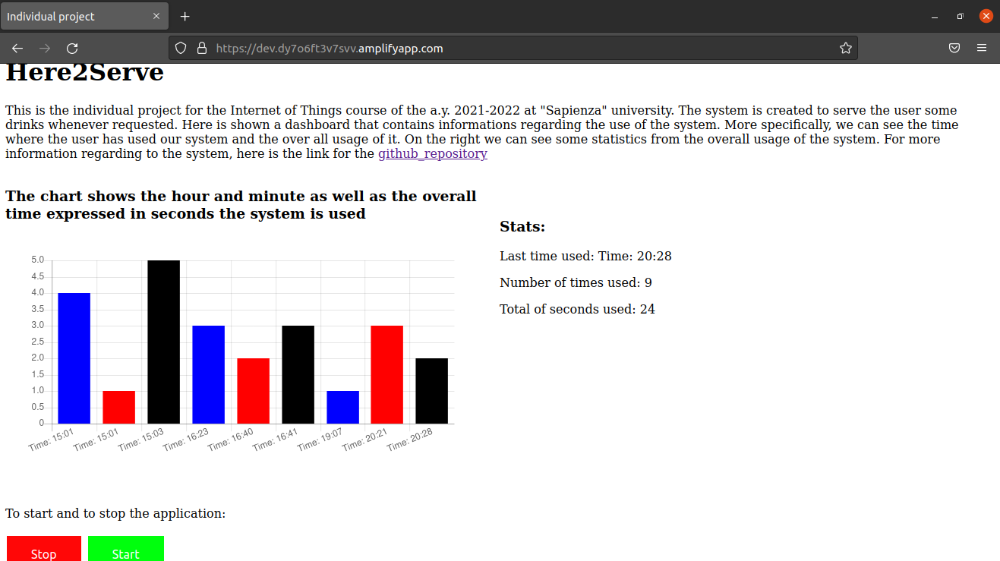 

## Configuration
These are all the steps you need to do to run and enjoy the system.
### Cloud level
**DynamoDB:** 
 
Here we create a table to store the messages we receive from the iot-device level. For every message we store the timestamp of when the message is received and the values for the current activation of the pump. 

**IoT Core:**
 
To set up a new thing click on the button “connect device” on the [main page of AWS IoT](https://us-east-1.console.aws.amazon.com/iot/home?region=us-east-1#/home). 
Use the intructions to create the thing named "device_individual".
After that, we update the policy to make possible that the device is connected to every broker and that it can be subscribed to the topic in "topic_1" and publish messages to the topic out "topic_2". 
The next step is to create the rule so that everytime we receive a message from the Mosquitto borker, this message is then processed and stored in the DynamoDB. As we said before, we will take under consideration the timestamp of the message and its value that describe the activation time. 
  
**Lambda:**
 
Here we must create 2 lambda functions, both of them selecting the "python 3.8" option from the drop-down menu of the "Runtime".
One lambda function is used to get the data from the database and update the web dashboard. The other one is used to publish the messages whenever we press the button. 

**API Gateway:**
 
In this step, we create 2 REST API. One of them, trigers the lamda function to get the data from the database. The name of it is "Activation_TimeAPI", which is a POST method.
The other one, is called when we press a button. It is a GET method that trigers the other labda function which publishes one of the fillowing messages: {"Stop"/"Start"}.

**AWS Amplify:**
 
After we have created the REST API services, we copy their links into the code. Then we go at the AWS Amplify to host our web page. Firstly we need to zip the 3 files that are under the web_app folder and then we put a name for the application and choose to create it by using this 3 files zipped.  
Using the link after its creation, we can access to the web dashboard.
  
### IoT device level

After cloning this repository, we must also download the [repository](https://github.com/eclipse/mosquitto.rsmb) of mosquitto.rsmb and follow the guide in the link to set up the system correctly. Then go to the folder mosquitto.rsmb/rsmb/src and run the command:

- ./broker_mqtts config.conf
  
To execute the code for the transparent bridge, we must be located in home directory of this repository and execute the command:

- python3 transparent_bridge.py
  
Connect all the sensors and actuators to the board using the following schema.
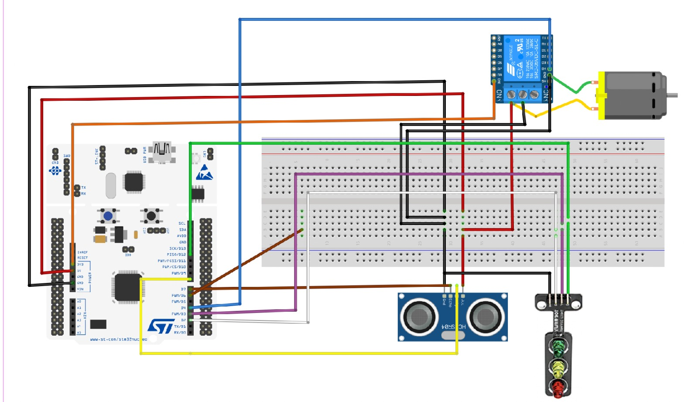
  

Connect the board to the machine and run the following commands:

- sudo ./RIOT/dist/tools/tapsetup/tapsetup
    
then go inside the “Riot Code” folder and run the command:
- make flash term

## Useful Links
[Demo](https://www.youtube.com/watch?v=SLmBNA-ujSA)
[Linkedin Profile](https://www.linkedin.com/public-profile/settings?lipi=urn%3Ali%3Apage%3Ad_flagship3_profile_self_edit_contact-info%3BIBuyH%2BI8S8WMSqIn7dUb8A%3D%3D)

## Images from the system 
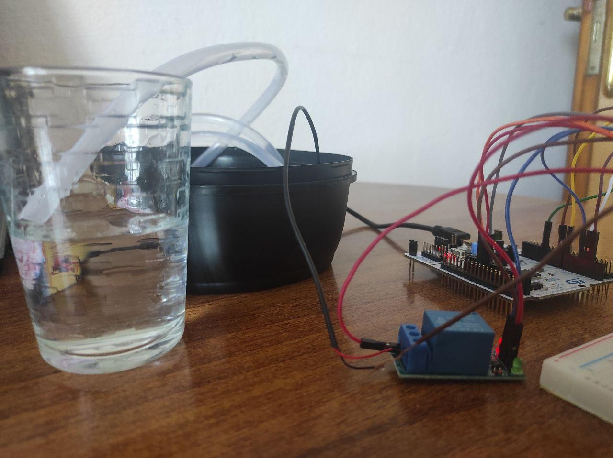
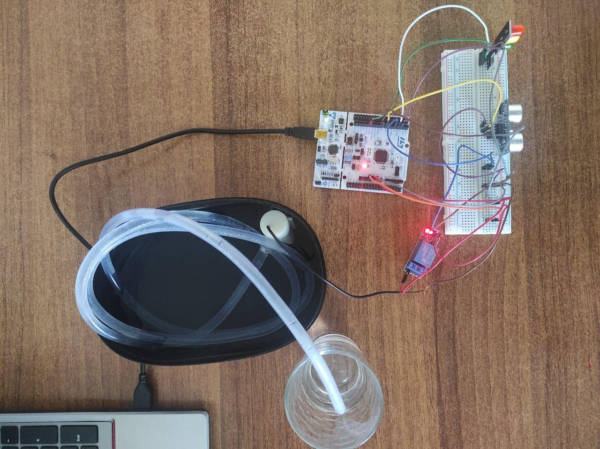
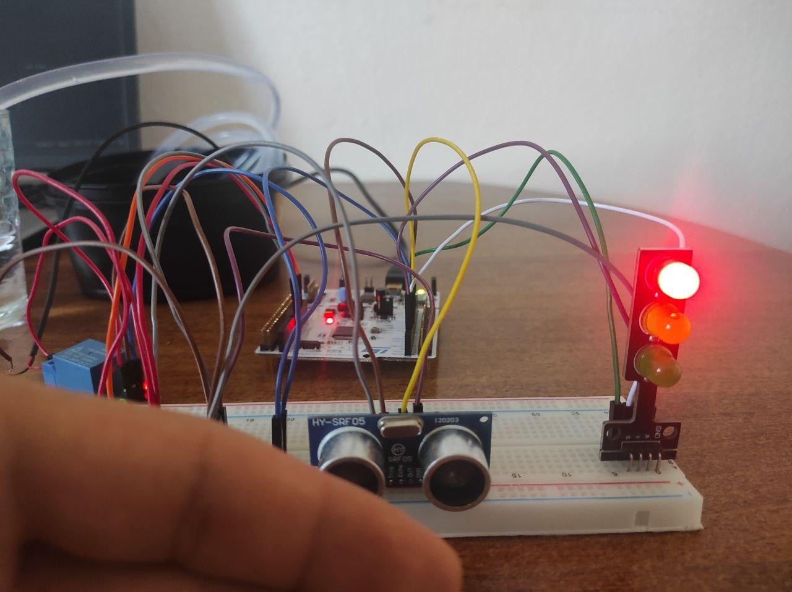
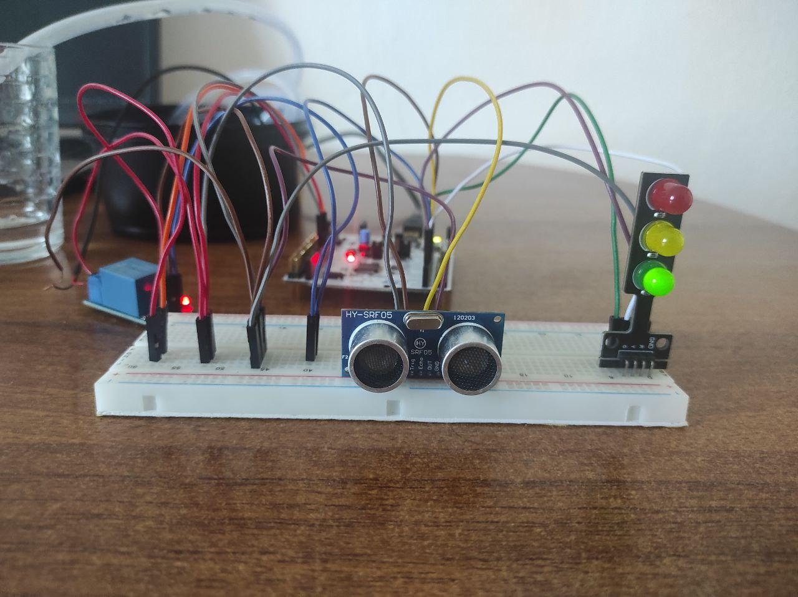
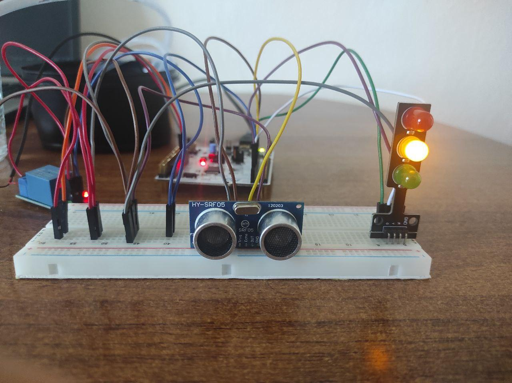